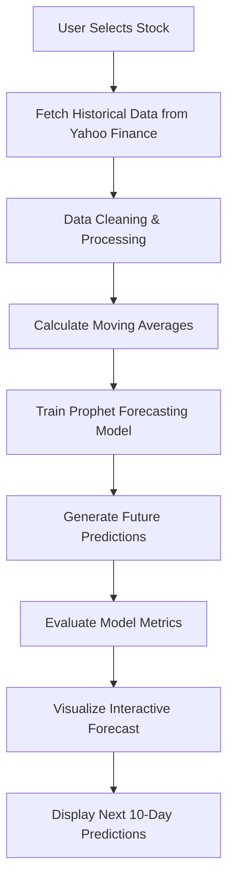
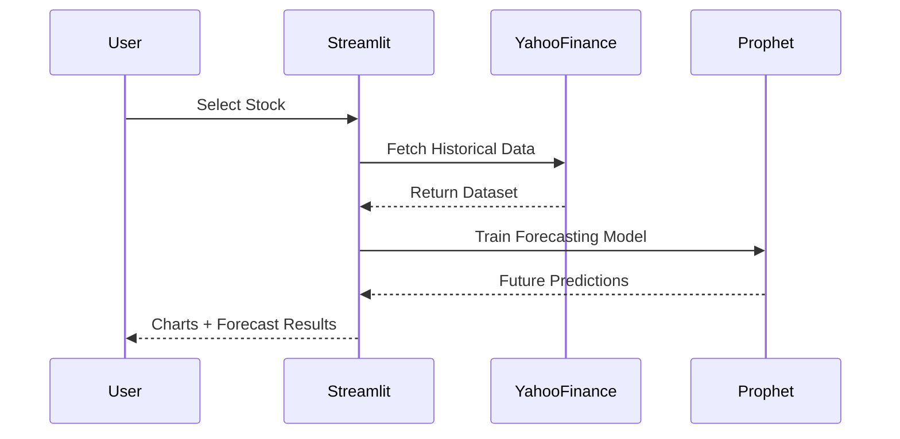

# 📈 Stock Price Forecasting App  
### AI-Powered Financial Forecasting using Prophet & Streamlit

<div align="center">


### 🔗 Live Demo
[](https://stock-price-forecasting-p5bl55dzc6g9qehimffvfj.streamlit.app/)

</div>

---

# ✨ Overview

An end-to-end **Machine Learning stock forecasting web application** that predicts future stock prices using **Meta's Prophet Time Series Forecasting Model**.

The application fetches real-time historical market data from **Yahoo Finance**, visualizes trends with interactive charts, and forecasts future prices with confidence intervals.

Built for:
- 📊 Financial Analysis
- 🤖 Machine Learning Demonstration
- 📈 Time Series Forecasting
- 🌐 Streamlit Deployment Projects

---

# 🚀 Features

<table>
<tr>
<td width="50%">

### 📊 Visualization
- Interactive candlestick charts
- 20-Day Moving Average
- 50-Day Moving Average
- Zoom & hover analytics

</td>

<td width="50%">

### 🔮 Forecasting
- Future stock prediction
- Confidence interval bands
- Trend decomposition
- Next 10-day forecast table

</td>
</tr>

<tr>
<td width="50%">

### 📉 Evaluation
- RMSE
- MAE
- MAPE
- Forecast diagnostics

</td>

<td width="50%">

### ⚡ Deployment
- Streamlit Cloud Hosting
- Fast loading UI
- Responsive layout
- Clean dashboard interface

</td>
</tr>
</table>

---

# 🧠 Machine Learning Pipeline



---

# 🏗️ System Architecture


---

# 🖼️ Application Workflow



---

# 📁 Project Structure

```bash
stock-forecasting/
│
├── data/
│   ├── __init__.py
│   └── fetch_data.py
│
├── models/
│   ├── __init__.py
│   ├── lstm_model.py
│   └── prophet_model.py
│
├── app.py
├── requirements.txt
├── runtime.txt
└── README.md
```

---

# ⚙️ Installation

## 1️⃣ Clone Repository

```bash
git clone https://github.com/pabi1234810/stock-price-forecasting.git

cd stock-price-forecasting
```

---

## 2️⃣ Create Virtual Environment

### Windows
```bash
python -m venv venv

venv\Scripts\activate
```

### Mac/Linux
```bash
python3 -m venv venv

source venv/bin/activate
```

---

## 3️⃣ Install Dependencies

```bash
pip install -r requirements.txt
```

---

## 4️⃣ Run Streamlit App

```bash
streamlit run app.py
```

Open browser at:

```bash
http://localhost:8501
```

---

# 📊 Supported Stocks

| 🇮🇳 Indian Stocks | 🇺🇸 US Stocks |
|---|---|
| TCS | Apple |
| Reliance Industries | Tesla |
| Infosys | Google |
| HDFC Bank | Microsoft |
| Wipro | Amazon |
| ICICI Bank |  |
| SBI |  |
| Adani Enterprises |  |
| Bajaj Finance |  |
| Hindustan Unilever |  |

---

# 📈 Forecasting Model

## 🔮 Prophet by Meta

| Capability | Description |
|---|---|
| Trend Modeling | Captures long-term movement |
| Seasonality | Weekly & yearly patterns |
| Confidence Intervals | Forecast uncertainty bands |
| Missing Data Handling | Robust against gaps |
| Outlier Resistance | Stable forecasting |

---

# 📉 Evaluation Metrics

| Metric | Meaning |
|---|---|
| RMSE | Penalizes large prediction errors |
| MAE | Average absolute forecasting error |
| MAPE | Percentage forecasting error |

---

# 🛠️ Tech Stack

<div align="center">

| Technology | Usage |
|---|---|
| Python 3.11 | Core Language |
| Streamlit | Frontend & Deployment |
| Prophet | Forecasting Engine |
| Plotly | Interactive Charts |
| yFinance | Financial Data API |
| Pandas / NumPy | Data Processing |
| Scikit-learn | Model Evaluation |

</div>

---

# 🌐 Deployment

Deployed using **Streamlit Community Cloud**

### 🔗 Live Application
https://stock-price-forecasting-p5bl55dzc6g9qehimffvfj.streamlit.app/

---

# 🎯 Future Improvements

- ✅ LSTM Deep Learning Forecasting
- ✅ Portfolio Optimization Module
- ✅ Multi-stock comparison dashboard
- ✅ News sentiment analysis
- ✅ Technical indicators (RSI, MACD, Bollinger Bands)
- ✅ Real-time streaming predictions
- ✅ Export reports as PDF

---

# 👨‍💻 Author

<div align="center">

## Pabitra Chakraborty

B.E. Mechanical Engineering  
Jadavpur University (2023–2027)

### 🌐 Connect With Me

[](https://github.com/pabi1234810)

</div>

---

# ⭐ If you liked this project

Give the repository a ⭐ on GitHub and support the project!
